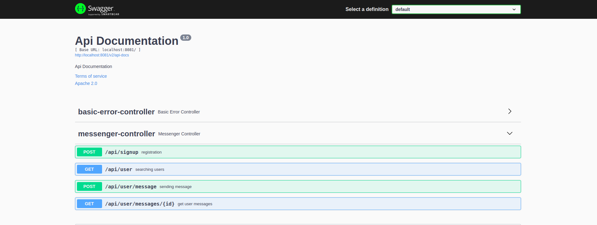
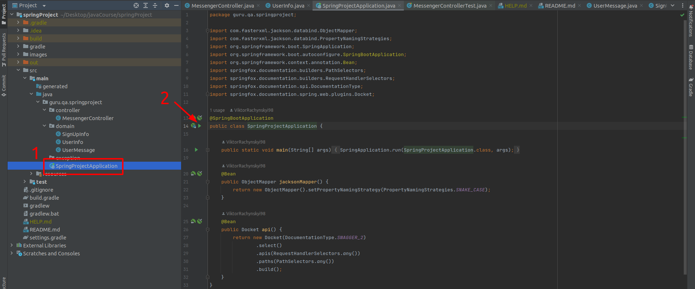
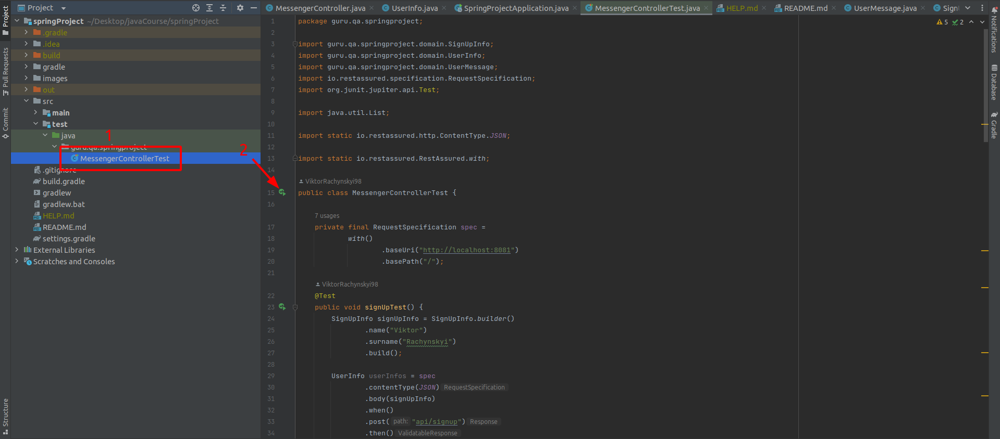

# REST API Service Project

### Used Technologies & Tools:

### Swagger as a REST API Service Self-Documentation:
Swagger is available on by link http://localhost:8081/swagger-ui/ after Service is started.

### How To Run Service:
The repository should be cloned and Service should be started. Service runs locally on 8081 port.

### List of the Automated Tests:
- [X] Sign up
- [X] Add User
- [X] Get User info
- [X] Get User info use filters
- [X] Send message
- [X] Get list of messages

### How To Run Tests  

=======